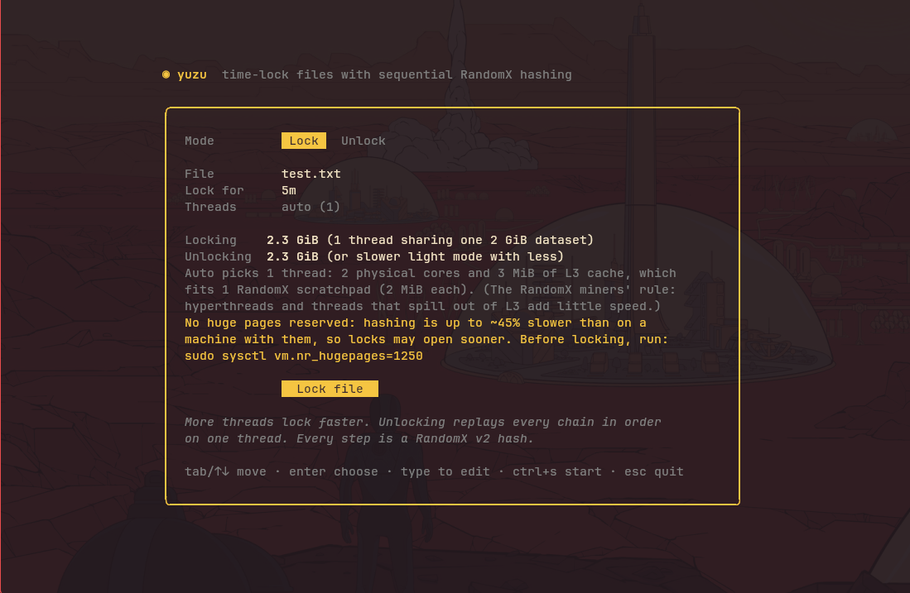
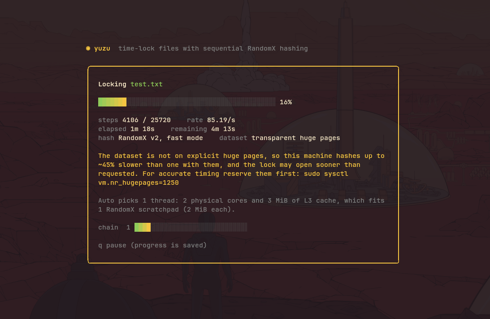

# yuzu

Lock a file for a set amount of time. You can't unlock it with a password,
only by spending the compute: a chain of **RandomX v2** hashes (the
algorithm Monero mines with) that has to run in order, on one core.

```
yuzu lock taxes.pdf -t 2h          # → taxes.pdf.yuzu
yuzu unlock taxes.pdf.yuzu         # ~2h of one core, ~2.4 GiB RAM
yuzu taxes.pdf.yuzu                # same, with plain text progress
yuzu                               # interactive TUI
```

<p>
  
  
</p>

## Build

Requires Zig 0.16 (`sudo dnf install zig` on Fedora), and an x86-64 CPU
with hardware AES. RandomX comes from [zig-randomx](zig-randomx/), the
port in this repository's `zig-randomx/` folder, which is its own package.

```
zig build -Doptimize=ReleaseFast   # binary at zig-out/bin/yuzu
zig build test
```

## How it works

1. **Prepare RandomX.** The file's random salt becomes the RandomX key.
   yuzu builds the 256 MiB cache and the 2 GiB dataset from it, using all
   cores, in about 10 seconds.
2. **Benchmark.** It times how many steps per second one core can do, then
   works out the total steps for the requested duration.
3. **Lock in parallel.** The work is split into *k* chains (one per thread).
   Each step is `x ← RandomX_v2(key = "yuzu/rx2" ‖ salt, input = x ‖ chain ‖ index)`.
   RandomX runs a fresh random program for every hash, built so that a
   general-purpose CPU is close to the fastest possible hardware for it. That
   keeps the advantage of specialized hardware small. All threads share the
   read-only dataset.
4. **Link the chains.** Chain *j*'s output encrypts chain *j+1*'s random seed.
   Only chain 0's seed is stored in the clear. The last chain's output
   (through HKDF-SHA256) becomes the file key.
5. **Encrypt.** The file is encrypted in 1 MiB chunks with
   XChaCha20-Poly1305, using the STREAM construction. The header is bound in
   as associated data, so any change to the header, a chunk, chunk order, or
   a truncated file is detected.
6. **Unlock one chain at a time.** The unlocker can't start chain *j+1* until
   chain *j* is done, so it walks all *k* chains in order on one core. Locking
   takes about T/k. Unlocking takes about T.

### Pausing and resuming

Both locking and unlocking can be paused with `q` or Ctrl+C. They also
survive a crash or reboot. Run the same command again to pick up where it
stopped.

- **Unlock** saves to `<file>.yuzu.progress` every 10 seconds, at each chain
  boundary, and when paused.
- **Lock** saves to `<file>.yuzu.lockstate` every 10 seconds and when paused.
  A resumed lock keeps its original duration, memory and chain count, but can
  run on a different number of threads: threads take chains from a queue.
  **This file holds the secret seeds.** Anyone who copies it can skip the
  work, so it's written owner-only (0600) and deleted as soon as the lock
  finishes. Delete it yourself to abandon a lock.

## Commands

| Command | |
|---|---|
| `yuzu lock <file> -t <dur>` | `-j N` lock threads (default: see below), `--steps N` fixed step count, `--remove` delete original, `-o` output, `-f` overwrite |
| `yuzu unlock <file.yuzu>` | `-o` output path, `-f` overwrite, `--light` RandomX light mode |
| `yuzu info <file.yuzu>` | parameters, saved progress; `--bench` estimates time on this machine |
| `yuzu bench` | single-core RandomX speed, mode and page kind |
| `yuzu selftest` | checks RandomX against its official v2 test vectors and yuzu's step against the reference C++ library |

In the interactive UI (`yuzu` with no arguments), press **Enter** on a field
to open its dropdown. You can also type into any field directly.

| Field | Enter opens |
|---|---|
| Mode | Lock / Unlock |
| File | a file browser (also **Ctrl+O**). Backspace goes up a folder, `h` shows hidden files, `~` jumps home. Unlock mode lists only `.yuzu` files |
| Lock for | presets from 5 minutes to 30 days, or Custom… |
| Threads | auto, or 1 to your CPU count |

In a dropdown, use ↑↓ to move, Enter to pick, `/` to filter, and Esc to
close. Tab closes a popup and moves to the next field. Start with the
**Lock file / Unlock file** button, or press **Ctrl+S** from anywhere.

Durations: `90s`, `30m`, `2h30m`, `1d12h`, `1w`.

### RAM and huge pages

RandomX needs about **2.4 GiB** of RAM to lock or unlock: one 2 GiB dataset
plus a 256 MiB cache, and every lock thread adds only 2 MiB. If an unlocking
machine has less free RAM, yuzu falls back to **light mode**: 300 MiB,
computing dataset items on the fly, several times slower. It produces the
same results. A *timed* lock always benchmarks in fast mode, because a
light-mode measurement would make the lock far too short for anyone who
unlocks in fast mode.

**Lock threads** default to the RandomX miners' rule: one per physical core,
and at most one per 2 MiB of L3 cache. Each thread's 2 MiB scratchpad has
to stay in L3. Hyperthreads, and threads that spill out of L3, add little
speed. A 2-core laptop with 3 MiB of L3 gets 1 thread, while an 8-core
desktop with 32 MiB gets 8. yuzu explains its choice, and says so when `-j`
asks for more than the CPU suits. The unlock time doesn't depend on this:
it's always one thread.

**Huge pages** make RandomX about 45% faster, and anyone racing a lock will
use them. yuzu uses explicit huge pages when they're reserved, then falls
back to transparent huge pages. It warns when a timed lock isn't measured on
explicit huge pages, and records the page kind in the file (`yuzu info`
shows it). For accurate timing, reserve them before locking:

```sh
sudo sysctl vm.nr_hugepages=1250
sudo sysctl vm.nr_hugepages=0       # release afterwards
```

## Self-test

A time-lock opens only if the build that unlocks computes exactly what the
build that locked did, possibly months later. Before every lock and unlock,
yuzu checks:

- RandomX against the official v2 test vectors.
- two chained yuzu steps (its key and input layout) against values computed
  independently with the reference C++ RandomX library (v2.0.1).

If any check fails, yuzu refuses to start. Run `yuzu selftest` to see the
results. zig-randomx itself has been compared against the reference
library on thousands of hashes and its full dataset (see its README).

## Limitations

- The duration is measured against **this** machine. A faster CPU or faster
  memory unlocks sooner, and a much slower machine takes longer. RandomX keeps
  the advantage of specialized hardware small, but doesn't remove it.
- x86-64 with hardware AES only, for now: zig-randomx has no ARM JIT or
  portable interpreter yet. A locked file can only be opened on such a
  machine.
- Locking does real work too: T ÷ threads.
- `--remove` is a normal delete, not a secure wipe. That's especially true on
  copy-on-write filesystems like Fedora's btrfs and on SSDs.
- Lose the `.yuzu` file and the data is gone. There's no back door.
